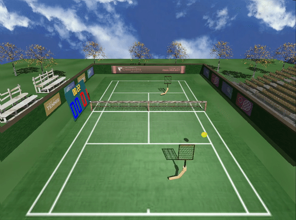
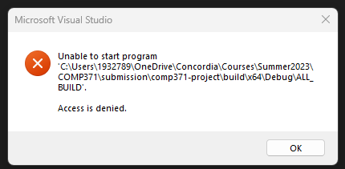
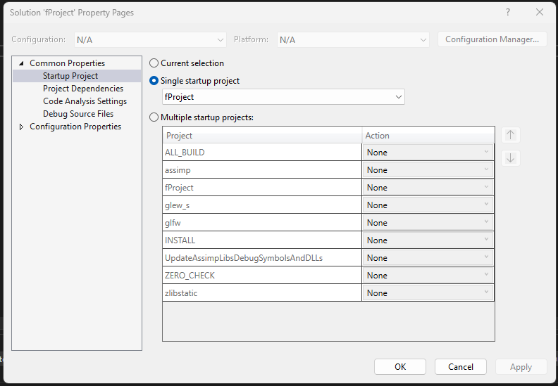
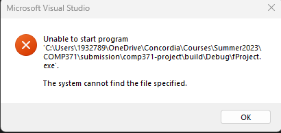
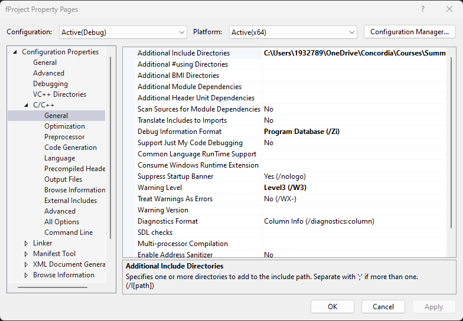
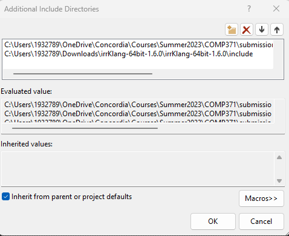
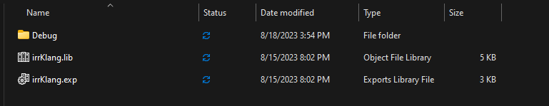
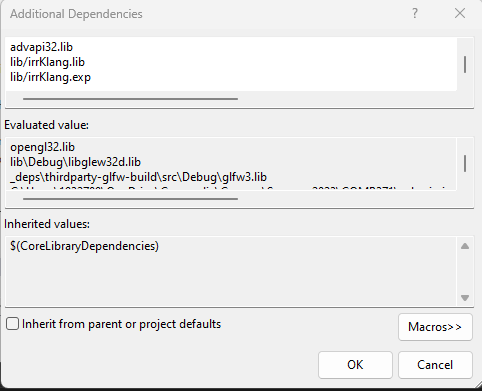
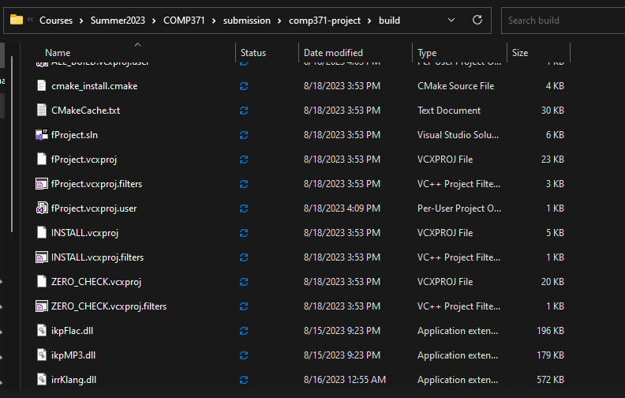

# COMP 371 - Tennis Final Project

## Description

A short and sweet demonstration of a two-person tennis game simulator that plays like a pong game. This game lets you control individual rackets, allowing players to skillfully maneuver and return the ball to each other. The integration of irrKlang and Assimp frameworks enhances the experience with realistic audio and 3D models. Enjoy a casual and engaging virtual tennis match with friends, where precise racket movements lead to exciting gameplay moments. Built using OpenGL and C++.



## Controls

Racket 1 (racket closer to camera):
- Arrow Keys to move
- L to perform swing

Racket 2 (racket on other side):
- WASD to move
- E to perform swing

## Build Instructions

### CMake

The following steps are the instructions needed to build and run the final project.

1. Download and Install the following dependancies: [CMake](https://cmake.org/download/), [Visual Studio](https://visualstudio.microsoft.com/)
2. Open a terminal or powershell
3. Run CMake with the following commands:

```
mkdir build
cmake -S . -B build
cmake --build build --target install
```

Alternatively, you can also use the CMake GUI to configure and generate the Visual Studio Project.

1. Download and Install CMake
2. Open the CMake GUI
3. Set the `Where is the source code:` field to the source folder
4. Set the `Where to build the binaries:` field to different location (e.g.: source_folder/build)
5. Click Configure
6. Click Generate

```
!!! WARNING !!! 
irrKlang is currently only compatible with the Visual Studio Community build kit meaning that other build kits will not be able to compile irrKlang's dependancies.
The following installation process will assume you are using the Visual Studio build kit, however if you decide to run the project using other build kits such as GCC, please use the scenery branch:

git fetch -v
git checkout scenery

From here, you should be able to build and run the project, however since irrKlang is not compatible, there will be NO SOUNDS so use at your discretion.
```

### Setting up irrKlang

The following steps are the instructions to set up the final project with irrKlang:

1. Download the irrKlang 64-bit version found on [Ambiera](https://www.ambiera.com/irrklang/downloads.html)
2. Extract it somewhere in your computer (e.g. your downloads folder). Make sure to remember where you extracted it.
3. Open Visual Studio, click `Open a project or a solution` and select `build/ > fProject.sln`
4. Try to run the project. The first error that should appear is the following:

   

5. To fix this, look in your Solution Explorer on your right. Right-click `Solution 'fProject' > Properties`
6. Select `Single Startup Project` and switch from `ALL_BUILD` to `fProject`. Select Apply and Ok

   

7. Now run the project again. Another error should pop up similar to the following:

   

8. Right click `fProject > Properties`, head to `C/C++ > General`. You should see the following:

   

9. Select `Additional Include Directories > Edit`. Add the full path to the `include/` directory of the extracted irrKlang folder downloaded earlier. Click Ok.
   e.g. `C:\Users\YourName\Downloads\irrKlang-64bit-1.6.0\irrKlang-64bit-1.6.0\include`

   

10. Inside irrKlang's folder, go to `lib > Winx64-visualStudio`. Copy `irrKlang.exp` & `irrKlang.lib` and paste these files into `comp371-project > build > lib`

    

11. In Visual Studio, head back to `fProject > Properties > Linker > Input`. Click on `Additional Dependancies > Edit`.
12. Add the following lines: `lib/irrKlang.lib` & `lib/irrKlang.exp`. Click Ok.

    

13. Inside the repository, find a `dll/` folder. Copy `ikpMP3.dll`, `irrKlang.dll` & `ikpFlac.dll` into `build/`. All dependancies should set up properly now.

    

14. In Visual Studio, run `Build > Rebuild Solution` & `Build > Rebuild fProject`. This could take a while. Ignore any errors once finished building.
15. Run the project by pressing the play button. The project should load and you should be able to play. Enjoy!
    

## Collaborators

- Juan-Carlos Sreng-Flores (40101813)
- Yash Patel (40175454)
- Massimo Mangiola (40235157)
- Daniel Lam (40248073)
- Joud Babik (40031039)
- Omar Alshanyour (40209637)

## References

Good place to learn OpenGL
https://www.learnopengl.com

Official OpenGL 4 Reference Documentation
https://www.khronos.org/registry/OpenGL-Refpages/gl4/

Official OpenGL Wiki
https://www.khronos.org/opengl/wiki/

Easy to Navigate OpenGL Function Documentation
http://docs.gl/

GLM Documentation
https://glm.g-truc.net/0.9.9/index.html

GLFW Documentation
https://www.glfw.org/

Good place for advanced graphics theory
https://www.scratchapixel.com/

